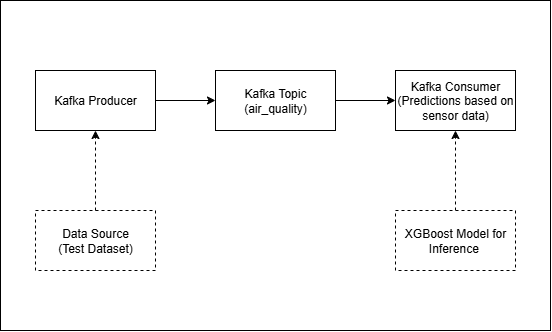

# Real-Time Air Quality Prediction with Kafka

A comprehensive machine learning pipeline for real-time air quality prediction using Apache Kafka streaming infrastructure, featuring exploratory data analysis, multiple predictive models, and live inference capabilities.

## Project Overview

This project demonstrates a complete end-to-end machine learning pipeline for air quality prediction, structured in three distinct phases:

1. **Phase 1 - Streaming Infrastructure**: Kafka-based data streaming setup
2. **Phase 2 - Data Intelligence**: Exploratory data analysis and feature engineering
3. **Phase 3 - Predictive Analytics**: Model training and real-time inference

The system processes the [UCI Air Quality dataset](https://archive.ics.uci.edu/dataset/360/air+quality) through a streaming pipeline, trains multiple predictive models (XGBoost, SARIMA, Seasonal Baselines), and provides real-time CO concentration predictions with an XGBoost model

## System Architecture



## Model Performance

| Model               | RMSE | MAE  | R²    | Description                           |
| ------------------- | ---- | ---- | ----- | ------------------------------------- |
| XGBoost             | 0.90 | 0.58 | 0.70  | Best performer with temporal features |
| SARIMA (Auto-ARIMA) | 1.84 | 1.54 | –0.23 | Classical statistical approach        |
| Seasonal Naive      | 1.69 | 1.24 | –0.04 | 24-hour persistence baseline          |

## Setup

### Prerequisites

- **Python 3.8+** (tested with Python 3.12)
- **Docker** for Kafka server
- **Git** for cloning the repository

### 1. Environment Setup

```bash
# Clone the repository
git clone https://github.com/thakkaryash21/real-time-air-quality-prediction-with-kafka
cd real-time-air-quality-prediction-with-kafka

# Create and activate virtual environment
python -m venv env
# Windows
env\\Scripts\\activate
# macOS/Linux
source env/bin/activate

# Install dependencies
pip install -r requirements.txt
```

### 2. Start Kafka Server

```bash
# Start Kafka in KRaft mode (Docker required)
docker run -d --name=kafka -p 9092:9092 apache/kafka

# Create Kafka topic
python -m src.utils.create_topic
```

### 3. Phase Execution

For detailed setup and execution instructions for each phase, please refer to the respective README files in each phase directory.
