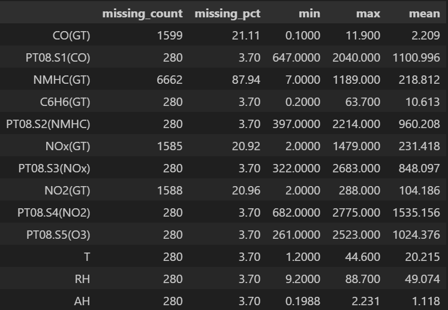

# Phase 2: Exploratory Data Analysis (EDA) Report

## Executive Summary

This report documents the exploratory data analysis (EDA) performed on the UCI Air Quality dataset as part of Phase 2 of the streaming infrastructure assignment. The objective is to extract temporal patterns, pollutant relationships, anomalies, and insights that form the foundation for predictive modeling (Phase 3).

Key findings include:

- **Clear temporal patterns**: daily commute cycles, weekday vs weekend differences, and seasonal variation in pollutant levels.
- **Strong correlations** between CO, NOx, and Benzene, suggesting common sources (traffic/combustion).
- **Statistically significant autocorrelations** that justify SARIMA modeling.
- **Outliers in pollutant concentrations** that align with real-world pollution events.

These insights directly inform feature engineering and the selection of predictive models (XGBoost + SARIMA).

## 1. Train–Test Split (Time-Based)

Unlike random splits common in non-temporal datasets, this project uses a time-based split:

- **Training set**: historical portion of the dataset. Used for EDA, statistical analysis, and training ML models.
- **Test set**: the most recent portion of the dataset, streamed in real time via Kafka.

This avoids data leakage and simulates real-world deployment, where the model only sees past data during training but must forecast on unseen future values.

## 2. Data Quality Overview

The data quality assessment reveals:

- Columns with High Missing Values:

  - `NMHC(GT)` is 88% missing making it unsuitable for modeling.
  - `CO(GT)`, `NOx(GT)`, and `NO2(GT)` have around 20% missing values.

- Columns with Low Missing Values
  - Most sensors (`PT08.*`) and weather variables (`T`, `RH`, `AH`) have around 3.7% missing, manageable with imputation.

Implications:

- Columns with high percentage of missing values will be excluded (e.g., `NMHC(GT)`).
- Other columns will be imputed using interpolation, forward-fill, or model-based imputation at training time.

## 3. Temporal Analysis

**Seasonal patterns**

_timeseries.png>)
_timeseries.png>)
_timeseries.png>)

- Time-series plots of `CO(GT)`, `NOx(GT)`, `C6H6(GT)` with 24h rolling means.

- Clear seasonality with higher pollution in winter months (Nov–Feb) and lower levels in summer.

**Daily patterns:**

_hourly.png>)

- `CO(GT)` shows peaks during morning (7–9am) and evening (5–8pm) commute hours.

**Weekly patterns:**

_weekly.png>)

- Pollution is elevated on weekdays (especially Fridays), lower on weekends.

## 4. Correlation & P-Value Analysis

Correlation matrix and statistical significance testing reveal:

- **Strong pollutant correlations:**

  - `CO to C6H6`: 0.93
  - `CO to NOx`: 0.79
    These are statistically significant (p < 0.001) and they suggest that pollutants share common traffic/combustion sources.

- **Negative correlation with temperature:**

  - NOx vs T = –0.31 → colder weather worsens air quality.
  - CO shows weaker but still significant negative correlation with temperature.

- **Humidity (RH, AH):** weak correlations, but p-values suggest some interactions worth testing in multivariate models.

**Implication:**

- Redundant features (highly correlated pollutants) must be handled to prevent multicollinearity.
- Weather variables provide moderating context that improves forecast generalization.

## 5. Advanced Statistical Analysis

- **ACF (Autocorrelation Function):** shows strong correlations at multiples of 24 hours. This confirms daily periodicity.
- **PACF (Partial Autocorrelation Function):** identifies direct dependencies, guiding selection of AR/MA terms in SARIMA models.

### Time Series Decomposition

Decomposition of `CO(GT)` shows:

- **Trend:** Rising pollutant levels during winter.
- **Seasonality:** Daily and weekly cycles.
- **Residuals:** Spikes in anomalies.

### Anomaly Detection

Anomalies are defined as:

- Outliers in the residual component of decomposition.
- Sudden unexplained spikes inconsistent with seasonality/trend (e.g., episodic events like traffic surges or industrial activity).

These anomalies are critical both for model robustness (handling outliers) and for business intelligence (pollution event monitoring).

## 6. Feature Engineering

For predictive modeling in Phase 3, we created two datasets:

- `train.csv` → cleaned dataset with raw variables.
- `train_features.csv` → enriched dataset with engineered features.

### Features engineered:

1. **Lag features:** pollutant values at `t–1`, `t–24`, etc., capturing autocorrelation.
2. **Rolling averages:** smoothed pollutant values over 3h/24h windows.
3. **Cyclical encodings:** hour-of-day and day-of-week encoded as sine/cosine to preserve periodicity.
4. **Weather interactions:** pollutant × temperature/humidity interaction terms to capture conditional dependencies.

**Rationale:**
These features leverage the autocorrelation and correlation analyses performed, making the dataset suitable for both XGBoost and SARIMA.

## 7. Analytical Insights & Business Intelligence

- **Traffic emissions** drive clear hourly/weekly cycles.
- **Heating-related pollution** spikes in colder months.
- **Strong pollutant correlations** highlight shared emission sources.
- **Anomalies** represent episodic pollution events, which have operational significance for city monitoring systems.

**Strategic implication:** models must incorporate temporal structure, weather dependencies, and lagged pollutants to achieve reliable forecasting.
